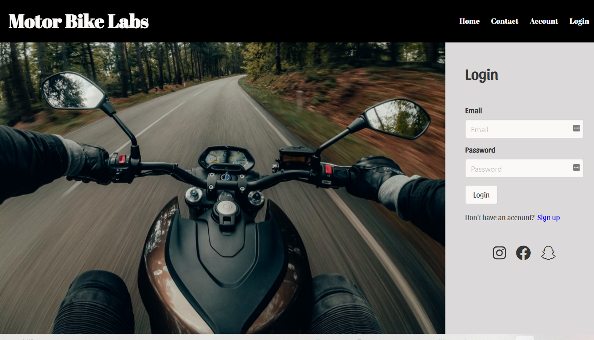
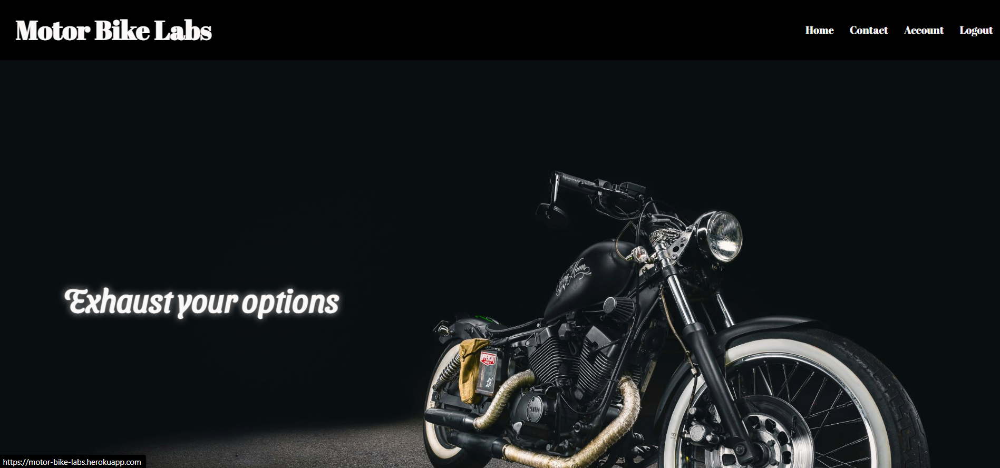
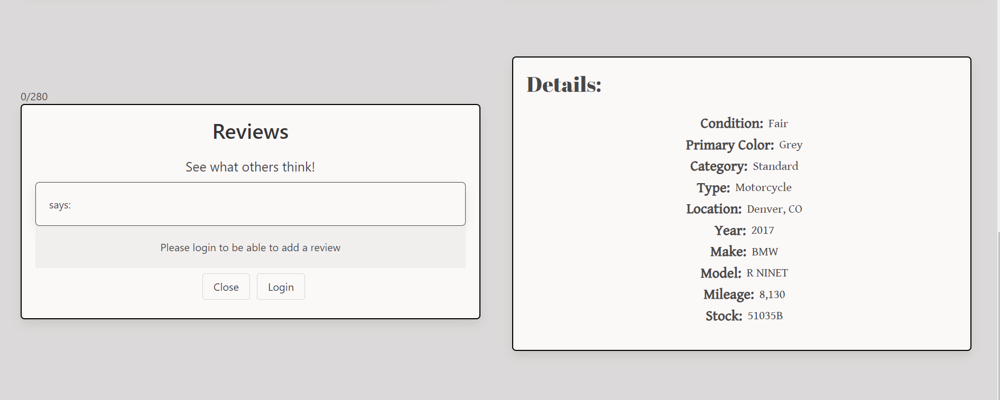
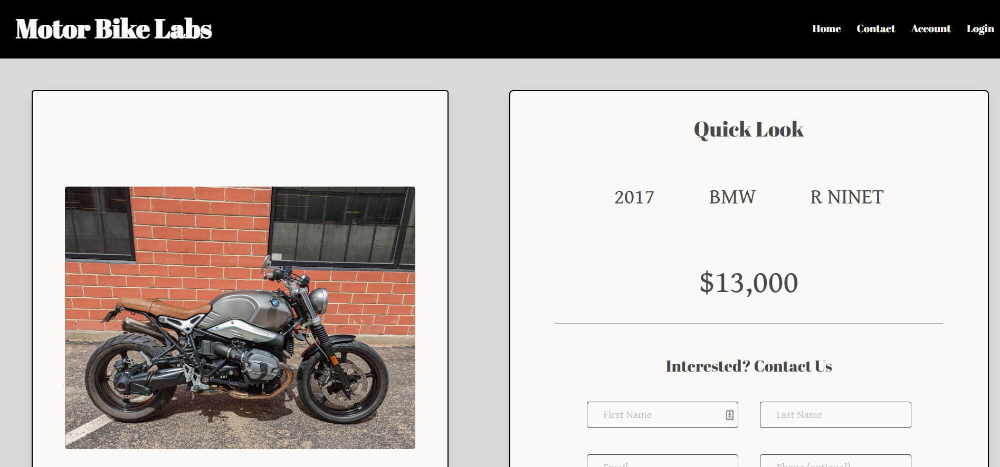
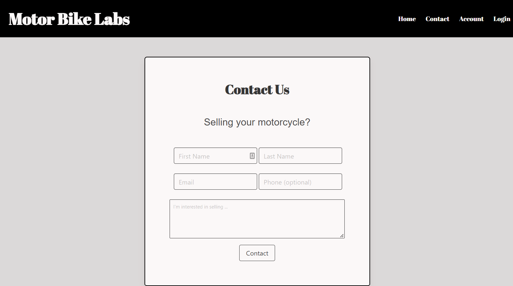

# Motor Bike Labs  

## Purpose
As a motorcycle enthusiast, I want an ecommerce website that allows me to search for my future ride, so I can navigate purchase options. On application, the user will be able to sign up to create an acount and then login to Motor Bike Labs. When the user logs in, they are able to see all of the used motorcycles available. They can browse through these motorcycles and can select a motorcycle to view more information on that particular motorcycle. When logged in, the user will also be able to leave a review about any of the motorcycles available.

//authorization
//dropdown filter
//favorites page

## Table of Contents
- [Technologies Utilized](#Technologies)
- [Deployed Application](#Deployed)
- [License](#MIT)
- [Contact](#Contact)

# About The Application:
  

## Technologies Utilized
- [MongoDB Atlas](https://www.mongodb.com/cloud/atlas)
- [Heroku](https://www.heroku.com)
- [NPM Apollo Client Package](https://www.npmjs.com/package/stripe)
- [NPM Apollo-Server-Express Package](https://www.npmjs.com/package/apollo-server-express)
- [NPM GraphQL Package](https://www.npmjs.com/package/graphql)
- [NPM Bcrypt Package](https://www.npmjs.com/package/bcrypt)
- [NPM Express.js Package](https://www.npmjs.com/package/express)
- [NPM JSONWebToken](https://www.npmjs.com/package/jsonwebtoken)
- [NPM Mongoose Package](https://www.npmjs.com/package/mongoose)
- [Node.js](https://nodejs.org/en/)
- [NPM nodemon Package](https://www.npmjs.com/package/nodemon)
- [NPM JWT-Decode Package](https://www.npmjs.com/package/jwt-decode)
- [NPM React Package](https://www.npmjs.com/package/react)
- [NPM React-Bootstrap](https://www.npmjs.com/package/react-bootstrap)
- [React-Dom](https://www.npmjs.com/package/react-dom)
- [React-Router-Dom](https://www.npmjs.com/package/react-router-dom)
- [React-Scripts](https://www.npmjs.com/package/react-scripts)

# Features :

1. Used 'Express.js' to build server

2. Used mongoose to create a relation to database 

## Deployed Application

https://motor-bike-labs.herokuapp.com/

## GitHub Repository
https://github.com/jen2ags/Motor-Bike-Labs

## Heroku Deployed Application
https://moto-bike-labs.herokuapp.com/

## Screen Shot
Login Screen:

Home Page:

Favorites Page:

Single Page:

Contact Page:

# Contact:

* If you have any questions, feel free to email Jugurta [email](mailto:djigo.maouchi@yahoo.com),  jennifer [email](mailto:), Cheryl[email](mailto:)

## Contribution
Made by Cheryl Cruz, Jugurta Maouchi, and Jennifer Jennings